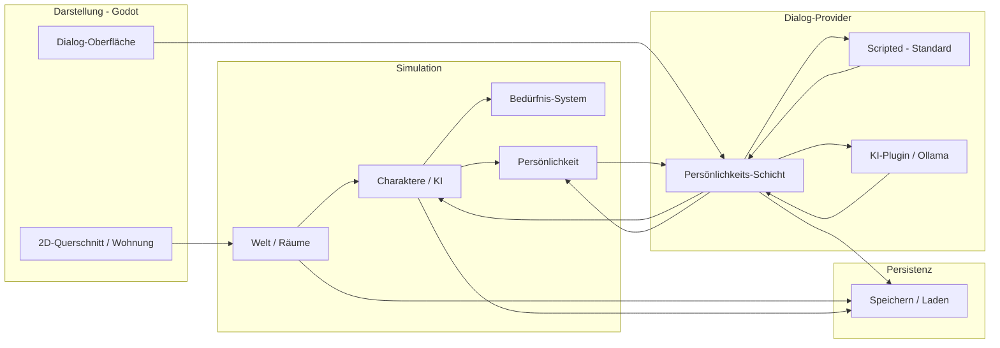

# Architektur-Übersicht

> Status: Planungsphase — Tech-Stack festgelegt ([ADR 0004](../adr/0004-tech-stack-godot-windows.md))

## Aktueller Stand

- **Engine:** Godot 4.6, **Windows-first** ([ADR 0004](../adr/0004-tech-stack-godot-windows.md))
- **Dialog:** Scripted Standard ([ADR 0007](../adr/0007-scripted-dialog-ki-plugin.md)); lokales LLM als **downloadbares KI-Plugin** ([ADR 0005](../adr/0005-lokales-llm-dialog.md))
- **Interaktion:** Nur Dialog mit eigener Figur ([ADR 0003](../adr/0003-spieler-interaktionsmodell.md))

## Grobkonzept (logisch)



## Geplante Module (Godot)

| Modul | Verantwortung | Pfad (geplant) |
|-------|---------------|----------------|
| Core | Spiel-Loop, Tick, Zustand | `src/core/` |
| World | Räume, Objekte (TileMap/Szenen) | `src/world/` |
| Agents | Charakter-Logik, autonome Entscheidungen | `src/agents/` |
| Personality | Traits, Memory, Prompt-/Template-Kontext | `src/personality/` |
| Dialogue | Scripted (Hybrid) + KI-Plugin; Provider-Interface | `src/dialogue/` |
| UI | Chat, Beobachtung | `src/ui/` |
| Persistence | Serialisierung | `src/persistence/` |

## Dialog-Provider ([ADR 0007](../adr/0007-scripted-dialog-ki-plugin.md))

| Provider | Lieferung | Wann |
|----------|-----------|------|
| **Scripted** | Basis-Installer | Immer verfügbar |
| **KI (Ollama)** | Separates Plugin, downloadbar | Optional in Einstellungen |

Persönlichkeits-Schicht ist **gemeinsam** — nur die Antwortgenerierung unterscheidet sich.

## Spiel-Loop (Entwurf)

```text
1. Tick: Bewohner prüft Bedürfnisse → wählt autonome Aktion
2. Anwender sendet Nachricht → Persönlichkeits-Schicht baut Kontext
3. Aktiver Provider (Scripted oder KI) generiert Antwort
4. Persönlichkeits-Schicht aktualisiert Traits und Memory
5. Zustand wird persistiert
```

## Getroffene Entscheidungen

| Thema | Entscheidung | ADR |
|-------|--------------|-----|
| Engine | Godot 4.6, GDScript | [0004](../adr/0004-tech-stack-godot-windows.md) |
| Plattform Start | Windows only | [0004](../adr/0004-tech-stack-godot-windows.md) |
| Dialog Einführung | Scripted + KI-Plugin | [0007](../adr/0007-scripted-dialog-ki-plugin.md) |
| Scripted Dialog | Hybrid (Intent + Pools) | [0009](../adr/0009-scripted-dialog-hybrid.md) |
| Dialog Ziel (KI) | Lokales LLM / Ollama | [0005](../adr/0005-lokales-llm-dialog.md) |
| Spieler-Interaktion | Nur Dialog, emergente Persönlichkeit | [0003](../adr/0003-spieler-interaktionsmodell.md) |
| Besuche | Per Code, später | [0006](../adr/0006-besuchs-system.md) |

## Offene Entscheidungen

| Thema | Optionen | ADR |
|-------|----------|-----|
| Persistenz-Format | JSON | [0008](../adr/0008-persistenz-json.md) |
| Architektur-Stil in Godot | Nodes/OOP, ggf. ECS-Addon | TBD |

## Nächste Schritte

1. Godot-4-Projekt unter `src/` anlegen
2. `DialogueProvider`-Interface definieren
3. Scripted-Prototyp für Phase 1
4. Datenmodell Persönlichkeit + Memory skizzieren
