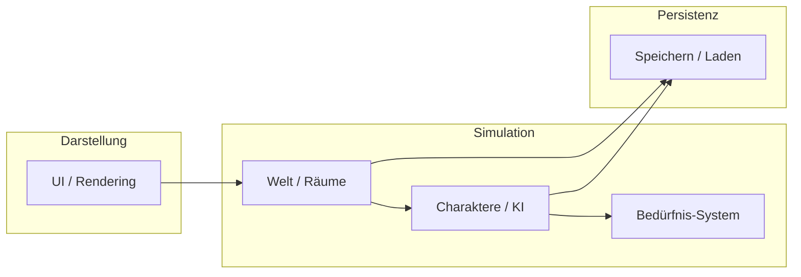

# Architektur-Übersicht

> Status: Planungsphase – Tech-Stack noch offen

## Aktueller Stand

Die technische Architektur ist noch nicht festgelegt. Entscheidungen werden als [Architecture Decision Records](../adr/) dokumentiert.

## Grobkonzept (logisch)

## Geplante Module (Entwurf)

| Modul | Verantwortung | Pfad (geplant) |
|-------|---------------|----------------|
| Core | Spiel-Loop, Tick, Zustand | `src/core/` |
| World | Räume, Objekte, Kollision | `src/world/` |
| Agents | Charakter-Logik, Entscheidungen | `src/agents/` |
| UI | Darstellung, Eingabe | `src/ui/` |
| Persistence | Serialisierung | `src/persistence/` |

> Die konkreten Pfade unter `src/` werden nach Tech-Stack-Entscheidung angepasst.

## Offene Entscheidungen

| Thema | Optionen | ADR |
|-------|----------|-----|
| Spielname | Byte Resident | [0002](../adr/0002-spielname-byte-resident.md) |
| Spielengine / Framework | Godot, Unity, Web (Canvas/WebGL), Custom | [0003 – TBD](../adr/) |
| Sprache | GDScript, C#, TypeScript, Rust, … | [0003 – TBD](../adr/) |
| Architektur-Stil | ECS, OOP, Hybrid | [0004 – TBD](../adr/) |
| Persistenz-Format | JSON, SQLite, Binary | [0005 – TBD](../adr/) |

## Nächste Schritte

1. Tech-Stack evaluieren und ADR schreiben
2. Modul-Grenzen verfeinern
3. Sequenzdiagramm für Spiel-Loop ergänzen
4. Datenmodell für Charakter und Welt skizzieren
